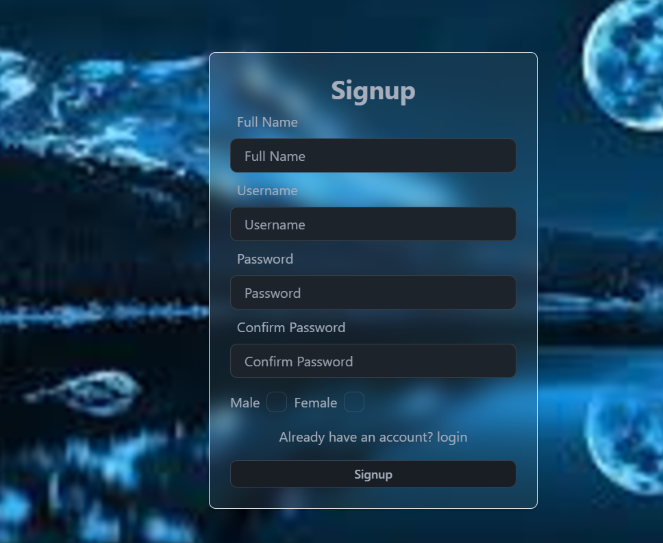
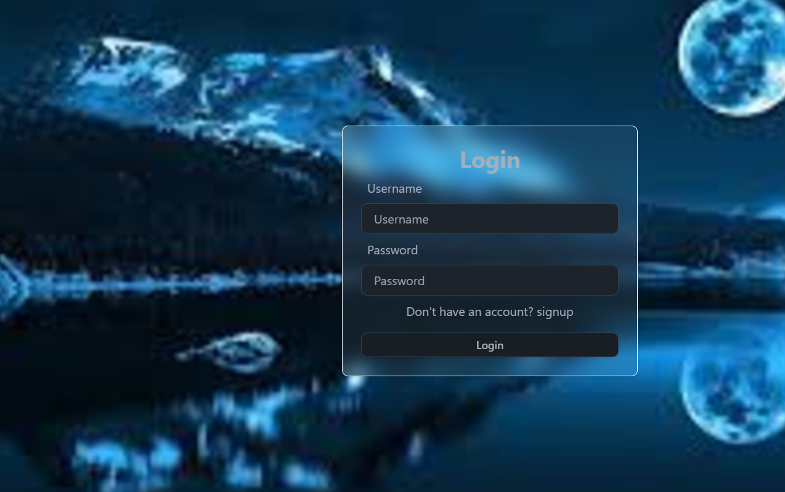
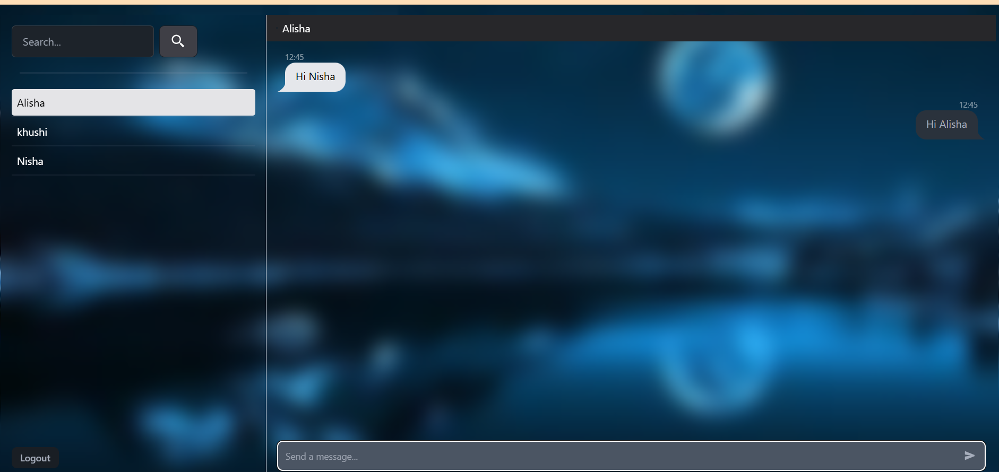

### Presentation

### Introduction
This project is called Chap App, a real-time chat application where users can send and receive messages instantly. It’s built with React.js for the front end, MongoDB for storing user data and chat history, Node.js for the backend, and Socket.io to handle live communication between users. Chat App ensures smooth and efficient messaging, providing users with a fast and reliable chatting experience.
# React.js (Frontend – User Interface) :
React makes the chat window, the input box, and the list of users. When a new message comes in, React updates the chat without needing to reload the page, making it feel fast and smooth.
# Node.js (Backend - Server) :
Node.js runs the server that controls everything in backend, like handling logins and sending messages to MongoDB. It also sets up the real-time messaging service (with the help of Socket.io).
# Socket.io (Real-time Communication) :
Socket.io makes it possible for you to send a message and see it appear immediately in the chat. It creates a constant connection between the server and the app, allowing messages to be pushed in real-time.
# MongoDB (Database – Storing Data): 
It stores things like user profiles, messages, and when they were sent. So, when you log in, MongoDB fetches your chat history and shows it to you.

### Features :
•	You can login or signup with password in encrypted from.
•	Chat with one person personally or in group.
•	Store your data or chat history.

### Project Structure Overview:
# 	Frontend (React.js):
o	Components: Chat window, message input, user list, login/signup forms.
o	State Management: Handles real-time updates for messages and user status.
#	Backend (Node.js):
o	Handles API requests, message broadcasting, and user management.
o	Uses Socket.io for managing WebSocket connections.
#	Database (MongoDB):
o	Stores user credentials, messages, and chat history for persistent data.
#	Real-Time Communication (Socket.io):
o	Maintains live connections for chat functionality, enabling immediate message delivery.

### Features :
•	You can login or signup with password in encrypted from.
•	Chat with one person personally or in group.
•	Store your data or chat history.

### Tech Stack:
	Client: React.js
	Server: Node.js
	Database: MongoDB
	Socket.io

### ER Diagram:
Key Entities and of this project:
User: 
       Details – Fullname, username, password, confirm password, gender
Message:
        Details - Message text, timestamp, sender, read/unread status.
Socket Connection:
       Details - Connection ID, user, socket ID, status.
### How they connect: 
User to Message: A user can send many messages, but each message is sent by one user.
User to Socket Connection: Each user has one active WebSocket connection when online.

### Demo: 
Authentication: 
 1.Sign in 

 

2.Login :- 
 

3.Welcome message :- 
 

4. Message :

 

### Step to set-up and run Project :-

1.Clone the repository
https://github.com/thecodernisha/MernChatApp.git

2.  Navigate to the frontend directory, install dependencies, and start the frontend server
	cd frontend
	npm install
	npm start

3. Navigate to the backend directory, install dependencies, and start the backend server
	cd backend
	npm install
	npm start

